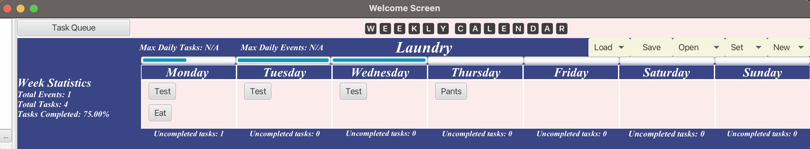
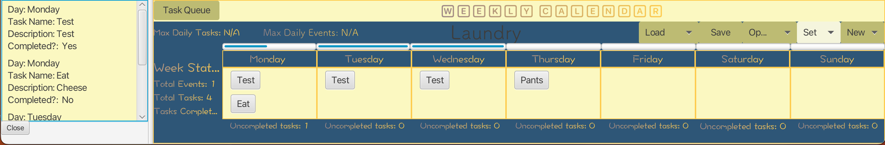
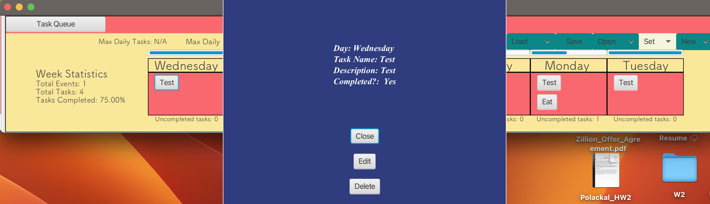

# 3500 PA05 Project Repo

[PA Write Up](https://markefontenot.notion.site/PA-05-8263d28a81a7473d8372c6579abd6481)

# GUIs

# Pitch

Welcome to our JavaJournal Application. This Daily Journal comes filled with chalkful
of features that will help ease the stress of managing your day! This calendar displays
a week view of the current week and supports two main scheduling items: task and event creation.
Events allow you to specify name,description,day,time, and duration. Tasks allow you to specify name,
description, and day. As you go about your day this calendar allows you to mark the tasks you completed
as complete. With the ability to set your own titles, you can save an unlimited amount of these calendars
and choose to re-enter it at a later time! Because we all like to have a little color in our lives,
this calendar comes preset with three beautiful themes ready to help set your mood going into the week, and
because we know life can be busy, we've created a dedicated task queue so you can view all your to-dos in one place!
Speaking of tasks, who doesn't love a little motivation! Our schedule gives you live on-the-fly task completion tracking
and displays to you the great progress your making along with statistics of your total week progress. Because we are all
human, we know mistakes can happen, that's why we've added functionality to delete any task or event you may have put
in there by accident. But sometimes accidents aren't so bad that you have to delete them, so we additionally implemented
edit features for tasks and events to help make sure everything is to your liking! Finally, for the hottest topic of
all,
does the week start on Sunday or Monday??? We here at the studio couldn't decide so we let you users start the week
off from ANY DAY OF THE WEEK!

# S
Our classes mainly have a single purpose, for example the Week class defines features of the week such as the title of
the week, the theme, and the max events and tasks, but our Day class contains the more specific information
of tasks and events in a given day. The view class only displays the gui. Additionally, our use of MVC clearly defines
our application into three distinct areas

# O
For future implementation, we don't want to modify our existing codebase. For example if we wanted to add a third
scheduling item into our week, our current structure of the JournalWeek class would allow us to simply write an
additional getter method, this allows us to extend what we already have, but we don't need to modify old code. Say we
had one getter method currently that returned tasks and events, this is an issue as then we would need to modify this
code to add a third scheduling item.

# L
Here our implementations of Controller and View only have public methods that exist in their respective interfaces. This
supports Liskov's substitution principle as these implementations would be suitable for their respective parent classes

# I
None of the classes that implement an interface in our program have to depend on methods they don't use
this helps us satisfy the Interface Segregation Principle

# D
In our inCalendar method in our controller, the method basically adds an item to a given day, because we shouldn't care
the kind of item it is so long as it is a SchedulingItem, we depend on the high level module SchedulingItem
as opposed to a Task or an Event to help promote the decoupling of our code

Possible Program Extensions: Quotes & Notes
If we were to decide to implement an additional feature such as Quotes & Notes we would extend
our program by first creating a label and button in the fxml file through SceneBuilder. From there,
we'd give the fx:ids and annotate them in the controller. In our buttons() method we'd add a setOnAction
for the button which would call our TextInputDialog(str) method to prompt the user to enter a quote/note and we use
the entered information to set the text of the label. All things considered, because we carefully thoughout our design
not much extension is necessary.

Calendar Source: https://www.vecteezy.com/png/17217991-3d-calendar-marked-date-and-time-for-reminder-day-in-purple-background-calendar-with-todo-list-for-schedule-appointment-event-day-holiday-planning-concept-3d-alarm-icon-render-illustration?utm_source=pinterest&utm_medium=social
